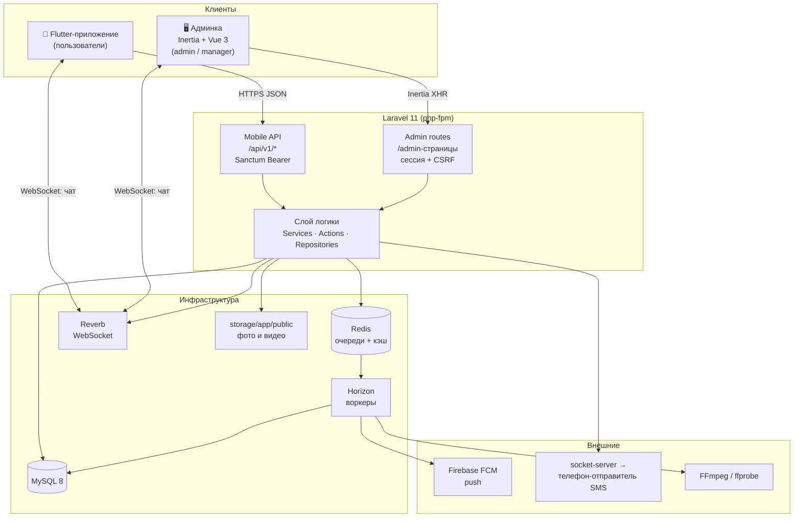
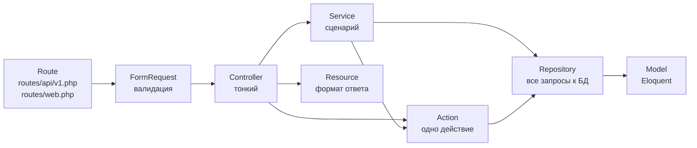
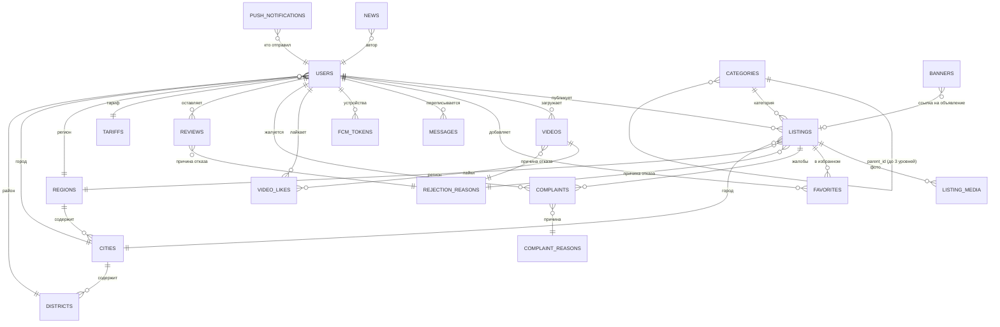
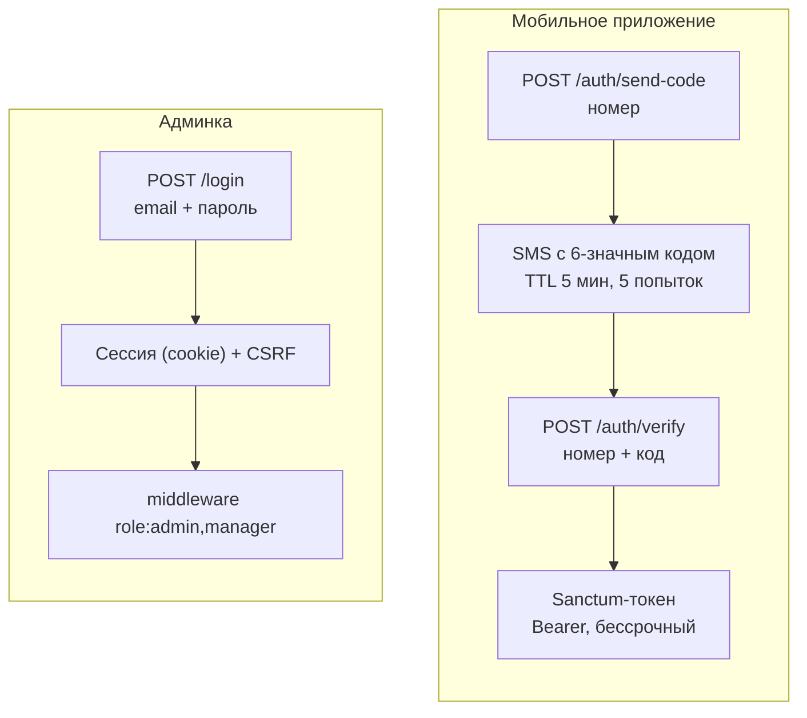
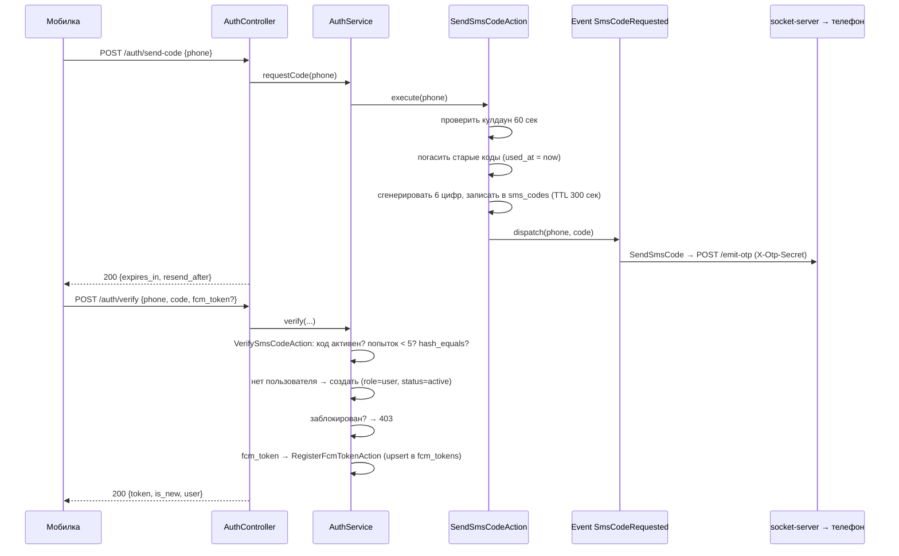
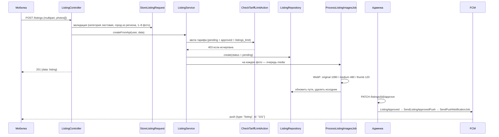
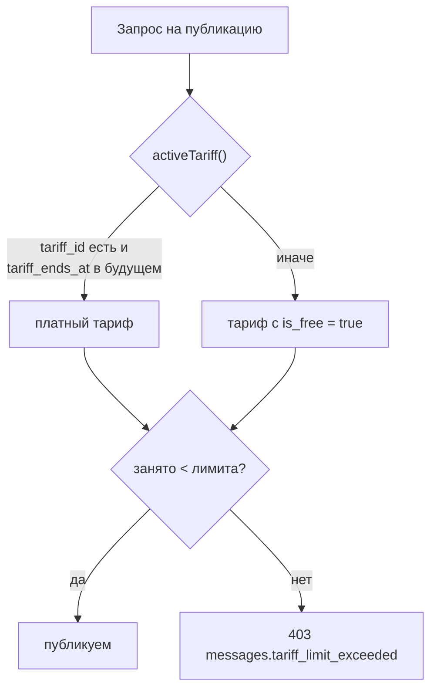
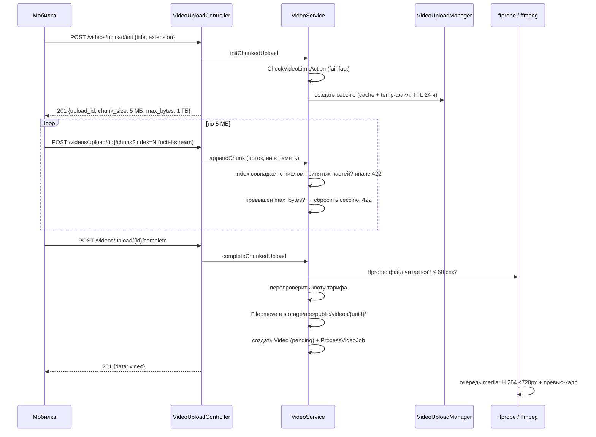
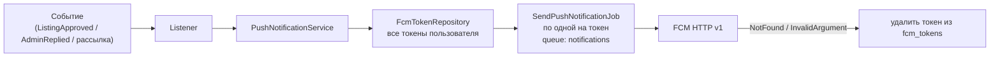

# Архитектура проекта «Daşoguz söwda»

Документ описывает, **как устроен бэкенд** и как с ним разговаривают мобильное
приложение и админка. Написан простым языком, с примерами запросов и ответов.

Актуально на: **26 августа 2026 г.** (после разбора раздела «Важно» из [AUDIT.md](AUDIT.md))
Источник правды — код: `routes/`, `app/`, `database/migrations/`.

Смежные документы:
- [AUDIT.md](AUDIT.md) — что сделано правильно, а что нет (отчёт по проблемам)
- [DEPLOY.md](DEPLOY.md) — развёртывание
- [../README.md](../README.md) — быстрый старт
- [../mobile_docs/BACKEND_API.md](../mobile_docs/BACKEND_API.md) — контракт, которого ждёт мобилка

---

## 1. Общая схема: кто с кем разговаривает

В системе три клиента и один бэкенд.



**Главное, что нужно понять:**

| Клиент | Как ходит | Как авторизуется | Формат ответа |
|---|---|---|---|
| Мобильное приложение | `GET/POST https://dashoguzsowda.com.tm/api/v1/...` | `Authorization: Bearer {token}` (Sanctum) | JSON `{data, meta, message}` |
| Админка | обычные веб-роуты, Inertia-запросы | сессия (cookie) + роль в `users.role` | Inertia-props (не JSON API) |

Админка и мобильное API — **два разных входа в одну и ту же логику**. Они делят
модели, сервисы и репозитории, но не делят контроллеры, валидацию и формат ответа.

Связь между ними самая обычная: мобильное приложение создаёт объявление со статусом
`pending`, админка его одобряет/отклоняет, после чего оно появляется (или не появляется)
в публичной ленте мобилки, а автору уходит push.

---

## 2. Слои: Route → Controller → Service → Repository

Правило простое: **каждый слой знает только про соседний снизу**.



### Что где лежит

| Слой | Каталог | Задача | Пример |
|---|---|---|---|
| Роуты API | `routes/api/v1.php` | префикс `/api/v1`, имена `api.v1.*` | `Route::post('/listings', ...)` |
| Роуты админки | `routes/web.php` | Inertia-страницы | `Route::resource('listings', ...)` |
| Form Request | `app/Http/Requests/Api/V1/`, `.../Admin/` | **вся** валидация | `StoreListingRequest` |
| Controller | `app/Http/Controllers/Api/V1/`, `.../Admin/` | принять → вызвать → вернуть | `ListingController` |
| Service | `app/Services/` | сценарий домена | `ListingService` |
| Action | `app/Actions/` | одно действие | `CheckTariffLimitAction` |
| Repository | `app/Repositories/` (+ `Interfaces/`) | запросы к БД | `ListingRepository` |
| Resource | `app/Http/Resources/Api/V1/` | JSON-представление | `ListingResource` |
| Model | `app/Models/` | таблица + связи | `Listing` |
| Event / Listener | `app/Events/`, `app/Listeners/` | побочные эффекты | `ListingApproved` → push |
| Job | `app/Jobs/` | фон: медиа, push | `ProcessVideoJob` |
| Observer | `app/Observers/` | model-события | `ListingObserver` |
| Middleware | `app/Http/Middleware/` | роли, локаль, блокировка | `EnsureRole` |
| Policy | `app/Policies/` | «моё / не моё» | `ListingPolicy` |

### Как это выглядит в коде

Контроллер — три строки, без единого запроса к БД:

```php
// app/Http/Controllers/Api/V1/ListingController.php
public function store(StoreListingRequest $request)
{
    $listing = $this->listingService->createFromApi($request->user(), $request->validated());

    return response()->json([
        'data'    => new ListingResource($listing),
        'message' => __('messages.listing_created'),
    ], 201);
}
```

Сервис — сценарий, БД только через репозиторий:

```php
// app/Services/ListingService.php
public function createFromApi(User $user, array $data): Listing
{
    $this->checkTariffLimitAction->execute($user);   // Action: квота тарифа

    $photos = $data['photos'];
    unset($data['photos']);

    $listing = $this->listingRepository->create([    // Repository: запись в БД
        ...$data,
        'user_id' => $user->id,
        'phone'   => $data['phone'] ?? $user->phone,
        'status'  => 'pending',
    ]);

    $this->attachListingPhotosAction->execute($listing, $photos); // Action: фото → очередь

    return $this->listingRepository->find($listing->id);
}
```

Интерфейсы репозиториев связываются с реализациями в
`app/Providers/AppServiceProvider.php` (`register()`), поэтому в сервис
инжектится `ListingRepositoryInterface`, а не конкретный класс.

### Действующие сервисы и репозитории

**Services (`app/Services/`)**
`AuthService`, `UserService`, `ListingService`, `VideoService`, `TariffService`,
`ChatService`, `FavoriteService`, `ReviewService`, `ComplaintService`,
`CategoryService`, `RegionService`, `NewsService`, `BannerService`,
`StatisticsService`, `DashboardService`, `NotificationService`,
`PushNotificationService`, `PushBroadcastService`, `SearchHistoryService`,
`MonitoringService`, `ImageConversionService`,
`Sms\LocalModemSmsService` / `Sms\LogSmsService`,
`Video\VideoUploadManager`, `Video\FfprobeVideoProbe`.

**Repositories (`app/Repositories/`)**
`ListingRepository`, `VideoRepository`, `UserRepository`, `CategoryRepository`,
`CategoryIconRepository`, `TariffRepository`, `ChatRepository`, `NewsRepository`,
`RegionRepository`, `ComplaintRepository`, `ReviewRepository`, `FavoriteRepository`,
`BannerRepository`, `SmsCodeRepository`, `NotificationRepository`, `FcmTokenRepository`,
`ReasonRepository`, `SettingRepository`, `PushNotificationRepository`,
`SearchRecentRepository`.

**Actions (`app/Actions/`)**
`CheckTariffLimitAction`, `CheckVideoLimitAction`, `CheckBoostLimitAction`,
`BoostListingAction`, `AttachListingPhotosAction`,
`ApproveListingAction` / `RejectListingAction`, `ApproveVideoAction` / `RejectVideoAction`,
`AssignTariffAction`, `BlockUserAction`, `SendSmsCodeAction`, `VerifySmsCodeAction`,
`RegisterFcmTokenAction`, `RemoveFcmTokenAction`, `UploadCategoryIconAction`,
`ToggleManagerNewsPermissionAction`, `ToggleManagerBannerPermissionAction`.

---

## 3. Модели и связи



### Пояснения к ключевым моделям

**`User`** (`app/Models/User.php`) — один класс на три роли (`role` = `admin` /
`manager` / `user`). Для пользователей приложения пароль не используется —
вход по SMS, в колонку кладётся случайная строка. `activeTariff()` возвращает
платный тариф, если `tariff_ends_at` в будущем, иначе — бесплатный.

**`Listing`** — объявление. `status` = `pending` / `approved` / `rejected`.
`tags` и `location` хранятся как JSON (`location` = `{lat, lng}`). `is_boosted` +
`boosted_at` — поднятие в выдаче.

**`ListingMedia`** — фото объявления. Три пути: `path` (оригинал/WebP),
`medium_path` (480×480), `thumb_path` (120×120). Пока `medium_path === null` —
фото ещё обрабатывается очередью.

**`Video`** — ролик до 60 секунд. `path` (оригинал), `processed_path` (сжатый
H.264), `preview_path` (кадр), `is_processed`. `likes_count` и `views` —
денормализованные счётчики.

**`Category`** — самоссылающееся дерево до 3 уровней (`Category::MAX_LEVEL`).
Объявление можно создать только в **листовой** категории.

**`Tariff`** — `listings_limit`, `videos_limit`, `boost_limit`, `duration_days`,
`is_free`. Ровно один тариф помечается `is_free` — он выдаётся всем по умолчанию.

**`Message`** — один диалог на пользователя (`user_id`), `sender` = `user` | `admin`.
Чата между пользователями нет.

**`Setting`** — key-value настройки: `boost_interval_hours`,
`manager_can_manage_news`, `manager_can_manage_banners`, `default_app_locale`,
`sms_gateway_last_sync_at`.

---

## 4. Эндпоинты Mobile API

Базовый URL: `https://dashoguzsowda.com.tm/api/v1`
Заголовки: `Accept: application/json`, `Accept-Language: tk|ru`,
для защищённых — `Authorization: Bearer {token}`.

Легенда «Авторизация»:
- **нет** — публичный
- **Bearer** — нужен токен
- **Bearer + not_blocked** — токен и пользователь не заблокирован
- **Bearer + owner** — токен и владение объектом (Policy)

### 4.1 Аутентификация

| Метод | URL | Тело | Авторизация | Лимит |
|---|---|---|---|---|
| POST | `/auth/send-code` | `phone` | нет | 5/мин |
| POST | `/auth/verify` | `phone`, `code`, `fcm_token?` | нет | 10/мин |
| POST | `/auth/logout` | `fcm_token?` | Bearer | — |

```http
POST /api/v1/auth/send-code
{ "phone": "+99361234567" }
```

```json
{
  "data": { "expires_in": 300, "resend_after": 60 },
  "message": "Код отправлен"
}
```

```http
POST /api/v1/auth/verify
{ "phone": "+99361234567", "code": "123456", "fcm_token": "fcm-abc..." }
```

```json
{
  "data": {
    "token": "17|Ab3xK...",
    "is_new": true,
    "user": { "id": 42, "phone": "+99361234567", "name": null, "avatar": null }
  },
  "message": "Успешно"
}
```

### 4.2 Профиль

| Метод | URL | Параметры | Авторизация |
|---|---|---|---|
| GET | `/profile` | — | Bearer |
| PUT | `/profile` | `name?`, `gender?`, `birth_date?`, `region_id?`, `city_id?`, `district_id?` | Bearer |
| POST | `/profile/avatar` | multipart `avatar` (jpg/png/webp ≤5 МБ) | Bearer |
| DELETE | `/profile/avatar` | — | Bearer |
| PUT | `/profile/fcm-token` | `fcm_token`, `platform?` (`android`\|`ios`) | Bearer |
| POST | `/profile/phone/send-code` | `phone` (свободный номер) | Bearer, 5/мин |
| POST | `/profile/phone/confirm` | `phone`, `code` | Bearer, 10/мин |
| GET | `/profile/tariff` | — | Bearer |

```json
// GET /api/v1/profile
{
  "data": {
    "id": 42,
    "phone": "+99361234567",
    "name": "Mekan",
    "gender": "male",
    "birth_date": "1990-05-15",
    "avatar": "http://.../storage/avatars/x.webp",
    "region_id": 1,
    "city_id": 2,
    "district_id": 3,
    "is_profile_complete": true,
    "region":   { "id": 1, "name_tk": "Ahal", "name_ru": "Ахал" },
    "city":     { "id": 2, "name_tk": "Änew", "name_ru": "Анау" },
    "district": { "id": 3, "name_tk": "Merkez", "name_ru": "Центр" },
    "created_at": "2026-07-01T09:00:00+00:00"
  },
  "message": "Success"
}
```

**`is_profile_complete`** — по нему приложение решает, куда вести после splash/OTP:
`false` → `/register`, `true` → `/home`. Считается на лету
(`User::isProfileComplete()`): имя не пустое **и** заданы `region_id` и `city_id`.

**Регион → город → район проверяются на согласованность.** Обновление частичное,
поэтому недостающие звенья берутся из текущего профиля: если прислать только
новый `region_id`, а сохранённый город принадлежит прежнему региону, придёт 422
с ошибкой на `city_id`.

```json
// GET /api/v1/profile/tariff
{
  "data": {
    "tariff": {
      "id": 1, "name_tk": "Mugt", "name_ru": "Бесплатный",
      "listings_limit": 5, "videos_limit": 2, "boost_limit": 1,
      "duration_days": 30, "is_free": true
    },
    "expires_at": null,
    "remaining": { "listings": 3, "videos": 2, "boosts": 1 }
  },
  "message": "Success"
}
```

### 4.3 Объявления

| Метод | URL | Параметры | Авторизация |
|---|---|---|---|
| GET | `/listings` | `search`, `category_id`, `region_id`, `city_id`, `type`, `price_min`, `price_max`, `sort`, `lat`, `lng`, `page`, `limit` | нет (с Bearer добавляется `is_favorite`) |
| GET | `/listings/my` | `status`, `page`, `limit` | Bearer |
| GET | `/listings/{id}` | — | нет |
| POST | `/listings` | multipart: `title`, `description`, `type`, `category_id`, `region_id`, `city_id`, `price?`, `phone?`, `tags[]?`, `location[lat]`, `location[lng]`, `photos[]` (1–8) | Bearer + not_blocked |
| PUT/POST | `/listings/{id}` | те же поля + `remove_media_ids[]` | Bearer + owner |
| DELETE | `/listings/{id}` | — | Bearer + owner |
| POST | `/listings/{id}/boost` | — | Bearer + owner + `approved` |

`sort`: `latest` (по умолчанию, поднятые сверху) · `price_asc` · `price_desc` ·
`nearest` (требует `lat` и `lng`).
`limit`: 1–50, по умолчанию 20.
`category_id` включает **всё поддерево** категории.
Multipart-обновление слать через `POST` — PHP не парсит multipart в `PUT`.

```json
// GET /api/v1/listings?category_id=5&sort=latest&limit=20
{
  "data": [
    {
      "id": 101,
      "title": "iPhone 15",
      "description": "Новый, в коробке",
      "type": "goods",
      "price": 2500.0,
      "phone": "+99361234567",
      "tags": ["apple", "telefon"],
      "location": { "lat": 37.95, "lng": 58.38 },
      "status": "approved",
      "views": 120,
      "is_boosted": true,
      "boosted_at": "2026-08-20T10:00:00.000000Z",
      "is_favorite": false,
      "category": {
        "id": 5, "parent_id": 2, "name_tk": "Telefonlar", "name_ru": "Телефоны",
        "path": [
          { "id": 1, "name_tk": "Elektronika", "name_ru": "Электроника" },
          { "id": 2, "name_tk": "Aragatnaşyk", "name_ru": "Связь" },
          { "id": 5, "name_tk": "Telefonlar", "name_ru": "Телефоны" }
        ]
      },
      "region": { "id": 1, "name_tk": "Ahal", "name_ru": "Ахал" },
      "city":   { "id": 2, "name_tk": "Änew", "name_ru": "Анау" },
      "user":   { "id": 42, "name": "Mekan", "avatar": null },
      "photos": [
        {
          "id": 900, "order": 1, "processing": false,
          "original": "http://.../storage/listings/101/photos/original/a.webp",
          "medium":   "http://.../storage/listings/101/photos/medium/a.webp",
          "thumb":    "http://.../storage/listings/101/photos/thumb/a.webp"
        }
      ],
      "created_at": "2026-08-19T12:00:00+00:00"
    }
  ],
  "meta":  { "current_page": 1, "last_page": 3, "per_page": 20, "total": 42 },
  "links": { "first": "...", "last": "...", "prev": null, "next": "..." }
}
```

> `is_favorite` появляется **только** если запрос сделан с Bearer-токеном.
> `processing: true` означает, что WebP-версии ещё не готовы, и все три
> ссылки временно указывают на загруженный оригинал.

### 4.4 Ролики (видео)

| Метод | URL | Параметры | Авторизация |
|---|---|---|---|
| GET | `/videos` | `search`, `tag`, `page`, `limit` | нет (с Bearer добавляется `is_liked`) |
| GET | `/videos/my` | `status`, `page`, `limit` | Bearer |
| GET | `/videos/{id}` | — | нет |
| POST | `/videos` | multipart `video` (≤100 МБ, ≤60 сек), `title`, `tags[]?` | Bearer + not_blocked |
| POST | `/videos/{id}/like` | — | Bearer, 60/мин |
| POST | `/videos/{id}/view` | — | нет, 60/мин |
| DELETE | `/videos/{id}` | — | Bearer + owner |

**Загрузка по частям** (файл любого размера):

| Метод | URL | Параметры |
|---|---|---|
| POST | `/videos/upload/init` | `title`, `tags[]?`, `filename?`, `extension?`, `total_size?` |
| POST | `/videos/upload/{uploadId}/chunk?index=N` | тело — сырой `application/octet-stream` |
| POST | `/videos/upload/{uploadId}/complete` | — |
| DELETE | `/videos/upload/{uploadId}` | — |

```json
// POST /api/v1/videos/upload/init
{ "data": { "upload_id": "a1b2...", "chunk_size": 5242880, "max_bytes": 1073741824 },
  "message": "Success" }
```

```json
// GET /api/v1/videos
{
  "data": [{
    "id": 7, "title": "Täze haryt", "tags": ["moda"], "status": "approved",
    "duration_seconds": 42, "likes_count": 15, "views": 300, "is_liked": true,
    "processing": false,
    "video":   "http://.../storage/videos/uuid/processed.mp4",
    "preview": "http://.../storage/videos/uuid/preview.jpg",
    "user": { "id": 42, "name": "Mekan", "avatar": null },
    "created_at": "2026-08-18T08:00:00+00:00"
  }],
  "meta": { "current_page": 1, "last_page": 1, "per_page": 20, "total": 1 }
}
```

### 4.5 Справочники (публичные)

| Метод | URL | Что отдаёт |
|---|---|---|
| GET | `/categories` | дерево активных категорий, до 3 уровней, поле `children` |
| GET | `/regions` | активные регионы → города → районы |
| GET | `/banners` | активные баннеры промо-карусели |
| GET | `/complaint-reasons` | активные причины жалоб |
| GET | `/news` | `type?` (`regular`\|`ad`), `page`, `limit` |
| GET | `/news/{id}` | одна опубликованная новость |

### 4.6 Избранное, отзывы, жалобы, чат

| Метод | URL | Параметры | Авторизация |
|---|---|---|---|
| GET | `/favorites` | — | Bearer |
| POST | `/favorites` | `listing_id` | Bearer |
| DELETE | `/favorites/{listing}` | — | Bearer |
| POST | `/reviews` | `text`, `rating?` (1–5), **ровно одно из** `listing_id` / `target_user_id` | Bearer + not_blocked, 10/мин |
| POST | `/complaints` | `listing_id`, `complaint_reason_id`, `text?` | Bearer + not_blocked, 10/мин |
| GET | `/chat` | — | Bearer |
| POST | `/chat` | `text` (≤5000) | Bearer |
| PATCH | `/chat/read` | — | Bearer |

### 4.7 Настройки и история поиска

| Метод | URL | Параметры | Авторизация |
|---|---|---|---|
| GET | `/preferences` | — | Bearer |
| PUT | `/preferences` | `onboarding_completed` (bool) | Bearer |
| GET | `/search/recent` | — | Bearer |
| POST | `/search/recent` | `query` (≤191, непустой после trim) | Bearer |
| DELETE | `/search/recent` | — | Bearer |

Язык и тема **не синхронизируются** — они остаются на устройстве. Через API
ходит только флаг прохождения онбординга, чтобы пользователь, прошедший его на
одном устройстве, не проходил заново на другом.

```json
// GET /api/v1/preferences
{ "data": { "onboarding_completed": false } }
```

История поиска — до **8** последних запросов, новые сверху. Гость хранит её
только на устройстве, поэтому роуты закрыты токеном.

```json
// POST /api/v1/search/recent  { "query": "iPhone" }
{ "data": ["iPhone", "Toyota", "Nike"] }
```

```json
// DELETE /api/v1/search/recent
{ "data": { "cleared": true } }
```

Дедупликация регистронезависимая и без учёта крайних пробелов: `iPhone`,
`  IPHONE  ` и `iphone` — один запрос, наверху остаётся последнее написание.
Ключ нормализации хранится отдельной колонкой `search_recents.query_key`, а не
задаётся unique-индексом по `query`, потому что регистронезависимость индекса
зависит от collation базы (в MySQL она есть, в SQLite для кириллицы нет).

### 4.8 Служебное

| Метод | URL |
|---|---|
| GET | `/api/health` → `{"status":"ok"}` |
| GET/POST | `/api/broadcasting/auth` — авторизация WebSocket-канала по Bearer-токену |

### 4.9 Формат ошибок

Все ошибки на `/api/*` приводятся к единому виду в
`bootstrap/app.php` — стек-трейс наружу не уходит даже при `APP_DEBUG=true`.

| Код | Когда | Тело |
|---|---|---|
| 401 | нет/невалиден токен | `{"message": "..."}` |
| 403 | чужой объект, заблокирован, исчерпана квота | `{"message": "..."}` |
| 404 | объект не найден либо не одобрен и не ваш | `{"message": "..."}` |
| 422 | валидация | `{"message": "...", "errors": {"field": ["..."]}}` |
| 429 | превышен rate limit | `{"message": "..."}` |
| 503 | нет ffprobe/ffmpeg на сервере | `{"message": "..."}` |
| 500 | всё остальное | `{"message": "..."}` |

```json
// 422
{
  "message": "The photos field is required.",
  "errors": { "photos": ["Нужно приложить от 1 до 8 фотографий"] }
}
```

---

## 5. Аутентификация и права доступа

### 5.1 Два независимых контура



**Пароля у пользователей приложения нет.** При регистрации в колонку
записывается `Hash::make(Str::random(40))` — вход только по SMS.

### 5.2 Роли

Роль хранится в колонке `users.role` (enum `admin` / `manager` / `user`).
Проверяется middleware `EnsureRole` (`role:admin,manager`) и хелперами
`isAdmin()` / `isManager()`.

| Может | admin | manager | user |
|---|---|---|---|
| Модерация объявлений / роликов / отзывов / жалоб | ✅ | ✅ | — |
| Чат поддержки (ответы) | ✅ | ✅ | — |
| Статистика, дашборд | ✅ | ✅ | — |
| Просмотр пользователей | ✅ | ✅ | — |
| Новости | ✅ | ⚙️ по флагу `manager_can_manage_news` | — |
| Баннеры | ✅ | ⚙️ по флагу `manager_can_manage_banners` | — |
| Создание/правка/блокировка пользователей, выдача тарифа | ✅ | ❌ | — |
| Тарифы, категории, регионы/города/районы | ✅ | ❌ | — |
| Удаление любых сущностей | ✅ | ❌ | — |
| Push-рассылка, настройки, справочники причин | ✅ | ❌ | — |
| Мобильное API | — | — | ✅ |

**Доступ описан в `routes/web.php` и только там** — контроллеры его не дублируют.
Всё, что закрыто от менеджера, лежит внутри вложенной группы `role:admin`.
Раскладка целиком зафиксирована тестом `tests/Feature/ManagerPermissionsTest.php`.

### 5.3 Middleware

| Алиас | Класс | Что делает |
|---|---|---|
| `role:...` | `EnsureRole` | пускает только перечисленные роли, иначе 403 |
| `news.permission` | `EnsureNewsPermission` | admin или manager с флагом в `settings` |
| `banner.permission` | `EnsureBannerPermission` | то же для баннеров |
| `not_blocked` | `EnsureUserIsNotBlocked` | заблокированный не публикует контент |
| — | `SetApiLocale` | `Accept-Language` → локаль (`tk`/`ru`, по умолчанию `ru`) |
| — | `SetAdminLocale` | `users.locale` → локаль админки |

### 5.4 Policies

`ListingPolicy` — `update`, `delete` (владелец), `boost` (владелец + статус `approved`).
`VideoPolicy` — `delete` (владелец).
Подключаются прямо в роуте: `->can('update', 'listing')`.

### 5.5 Токены и блокировка

- Токен создаётся в `AuthService::verify()` (`createToken('mobile')`), срока жизни нет.
- `POST /auth/logout` удаляет **текущий** токен и, если передан `fcm_token`, — токен устройства.
- Блокировка проверяется при входе (`AuthService::verify` → 403) и на публикующих
  роутах (`not_blocked`). Уже выданный токен при блокировке не отзывается — читать
  ленту заблокированный продолжит, публиковать — нет.

### 5.6 WebSocket

Канал `private-chat.{user_id}`, событие `new-message` (`NewMessageEvent`).
Авторизация канала (`routes/channels.php`): доступ у самого пользователя
либо у любого `admin`/`manager`. Мобилка авторизуется на `/api/broadcasting/auth`
(Bearer), админка — на `/broadcasting/auth` (сессия).

---

## 6. Ключевые бизнес-процессы

### 6.1 Вход по SMS



Пошагово:
1. Клиент шлёт номер. Валидация — `SendCodeRequest` (`/^\+?\d{8,15}$/`), троттлинг 5/мин.
2. `SendSmsCodeAction` проверяет, что с прошлой отправки прошло ≥ 60 сек, иначе 422.
3. Все предыдущие коды на этот номер помечаются использованными — активен только последний.
4. Код кладётся в `sms_codes` с `expires_at = now + 300 сек`.
5. Событие `SmsCodeRequested` → листенер `SendSmsCode` → драйвер по `SMS_DRIVER`:
   `log` (пишет в `laravel.log`) или `modem` (HTTP-запрос в socket-server).
6. Клиент шлёт код. `VerifySmsCodeAction` проверяет срок, число попыток (≤5) и само
   значение через `hash_equals`. Неверный код увеличивает `attempts`.
7. Если номера нет в БД — создаётся пользователь. Если заблокирован — 403.
8. Выдаётся Sanctum-токен; `is_new` подсказывает мобилке, вести ли на регистрацию.

### 6.2 Публикация объявления и модерация



Что важно:
- Статус всегда `pending` — его ставит и сервис, и `ListingObserver` (страховка).
- Квота считает `pending + approved`; отклонённые и удалённые место не занимают.
- Фото сохраняются во временную папку и **сразу отдаются клиенту**; конвертация
  идёт в очереди `media`, поэтому карточка не «мигает» пустотой.
- Отклонение (`PATCH /listings/{id}/reject`) требует `rejection_reason_id` и
  шлёт push `ListingRejected`.
- Редактирование владельцем (`ListingService::updateFromApi`) **всегда** возвращает
  объявление в `pending` и сбрасывает причину отказа.

### 6.3 Лимиты тарифа



- Объявления: `CheckTariffLimitAction` — занято = `pending + approved`.
- Ролики: `CheckVideoLimitAction` — так же.
- Поднятия: `CheckBoostLimitAction` — занято = число объявлений с `is_boosted = true`.
  Повторное поднятие уже поднятого объявления слот не занимает.
- Остаток лимитов: `TariffService::getRemainingLimits()`, отдаётся в `/profile/tariff`.
- Тариф выдаёт админ: `POST /admin users/{user}/tariff` → `AssignTariffAction` →
  `tariff_ends_at = now + duration_days`.

### 6.4 Поднятие объявления (boost)

1. `POST /listings/{id}/boost`, роут проверяет Policy `boost` (своё + `approved`).
2. `BoostListingAction` → `ListingService::canBoost()`: прошло ли
   `boost_interval_hours` (настройка админки, по умолчанию 24) с `boosted_at`.
   Не прошло → 422.
3. `CheckBoostLimitAction` → квота тарифа. Исчерпана → 403.
4. `is_boosted = true`, `boosted_at = now`.
5. В ленте `sort=latest` поднятые идут первыми (`orderByDesc('is_boosted')`).

### 6.5 Загрузка ролика по частям



Тело части не грузится в память целиком — используется потоковое чтение
(`$request->getContent(asResource: true)`).

### 6.6 Чат с поддержкой

1. Пользователь: `POST /chat {text}` → `ChatService::sendFromUser()` →
   запись в `messages` (`sender = user`) → `broadcast(NewMessageEvent)->toOthers()`.
2. Админ видит диалог в `/chat`, отвечает: `POST /chat/{user}/reply` →
   `ChatService::reply()` → запись (`sender = admin`) → broadcast + событие
   `AdminReplied`.
3. `AdminReplied` → `SendChatReplyPush` → `PushNotificationService::sendToUser()` →
   по одной `SendPushNotificationJob` на каждый токен устройства (очередь `notifications`).
4. Мобилка слушает `private-chat.{user_id}`, событие `new-message`.
5. Прочтение: пользователь — `PATCH /chat/read` (гасит сообщения админа),
   админ — открытие диалога гасит сообщения пользователя.

### 6.7 Push-уведомления



Deep-link payload (все значения — строки):
`{"type": "listing"|"news"|"chat"|"external"|"url", "id": "123"}`.
Для `external`/`url` вместо `id` передаётся `url`.
Неизвестный `type` или отсутствующий `id` → мобилка открывает `/home`.

Ручная рассылка — `/admin push` (только admin): выбор `all` / `selected` / `filtered`
(по региону и тарифу), запись факта отправки в `push_notifications`.

### 6.8 Обработка медиа

| Что | Очередь | Job | Результат |
|---|---|---|---|
| Фото объявления | `media` | `ProcessListingImagesJob` | WebP: original ≤1080, medium 480×480, thumb 120×120 |
| Ролик | `media` | `ProcessVideoJob` | H.264 CRF 23, ширина ≤720, `+faststart`, превью-кадр 360px |
| Push | `notifications` | `SendPushNotificationJob` | 3 попытки, backoff 60 сек |

Аватар конвертируется **синхронно** (`ImageConversionService`): квадрат 400×400
WebP, ≤80 КБ. Баннер — 2:1, ≤1200px, ≤150 КБ. Обложка новости — 16:9, ≤800px, ≤100 КБ.

---

## 7. Локализация

- Laravel: `lang/tk/`, `lang/ru/`, все строки — через `__('messages.key')`.
- Vue: `vue-i18n`, словари в `resources/js/i18n/tk.js` и `ru.js`.
- Мобильное API: локаль берётся из `Accept-Language` (`SetApiLocale`).
- Админка: локаль берётся из `users.locale` (`SetAdminLocale`), переключатель в топбаре.
- Справочники (категории, регионы, тарифы, причины) хранят обе версии:
  `name_ru` + `name_tk` — выбор языка делает клиент.

---

## 8. Что мобилка ждёт, но чего в коде ещё нет

Полный разбор — в [AUDIT.md](AUDIT.md), раздел «Расхождения со спецификацией».
Задачи 1–3 из `CLAUDE_CODE_BACKEND_PLAN.md` закрыты, остальное ждёт решений:

| Ожидается | Статус |
|---|---|
| `is_profile_complete` в `/v1/profile` | ✅ сделано |
| плоские `region_id` / `city_id` / `district_id` в `/v1/profile` | ✅ сделано |
| `GET/POST/DELETE /v1/search/recent` | ✅ сделано |
| `GET/PUT /v1/preferences` | ✅ сделано |
| `GET /v1/stores/popular`, `/stores/{id}`, `/stores/{id}/listings` | ❌ нет модели `Store`; нужно решение, что такое магазин |
| `store`, `tariff`, `stats`, `is_premium` в `/v1/profile` | ❌ зависит от домена Stores и формата тарифа |
| `GET /v1/tariffs`, `PUT /v1/profile/subscription` | ❌ нужно решение про оплату смены тарифа |
| `GET /v1/search/popular` | ❌ нужен источник статистики запросов |
